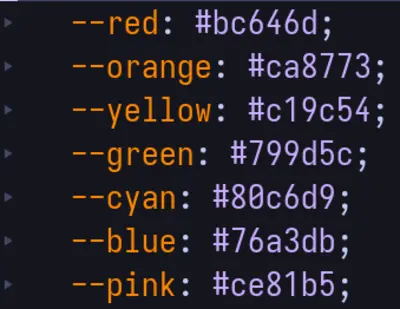
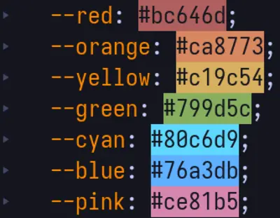

Chắc cũng vì ảnh hưởng bởi [rwxrob](https://linktr.ee/rwxrob), góc nhìn của tôi về các plugins có vẻ hơi _lạ thường_, tôi sẽ hạn chế hết mức việc sử dụng plugins. Thay vào đó, tận dụng tính năng `filter` của Vim để làm các khả năng mặc định Vim không có.

> **Filter là gì?**
>
> Chức năng filter trong Vim cho phép bạn áp dụng một lệnh shell lên một đoạn văn bản đã chọn. Khi bạn sử dụng filter, Vim sẽ gửi đoạn văn bản đó ra môi trường shell, thực hiện lệnh bạn cung cấp, rồi nhận kết quả trả về và thay thế đoạn văn bản ban đầu bằng kết quả đó.
>
> Một ví dụ cụ thể như lệnh sau: `:1,10!sort`. Khi nhận lệnh này, Vim sẽ gửi dòng 1 đến 10 trong văn bản ra môi trường shell, dùng lệnh `sort` để sắp xếp chúng, rồi thay thể 10 dòng này bằng kết quả đã được sắp xếp bởi lệnh `sort`.

Đây cũng là một trong những lý do tôi không dùng Neovim, việc lồng ghép cả một ngôn ngữ lập trình ngoại lai vào Vim là ngược lại với triết lý Unix, bạn có thể bất đồng quan điểm với tôi ở đây. Nếu thật sự cần những chức năng của một trình chỉnh sửa văn bản GUI (VS Code, Sublime Text...) thì hãy dùng các phần mềm đó. Đừng biến Vim trở nên xa rời với nguyên bản của nó chỉ để trở thành một bản sao chép không hoàn thiện của những phần mềm GUI khác.

Quan điểm này của tôi có thể hoàn toàn sai lầm, vì bản chất tôi không phải một lập trình viên, nên nhu cầu của tôi có thể không như bạn. Nhưng Vim cũng chỉ là một **trình chỉnh sửa văn bản**, hãy để nó chuyên tâm về vai trò của nó theo nguyên lý Unix.

## Các plugins

Dù giữ quan điểm như vậy, tôi vẫn xài hai plugins, do đó phần lớn của bài viết này sẽ là cách tôi quản lý chúng. Thay vì nói về cách dùng các plugins này.

### CSS color

Trong quá trình tạo dựng lên website này cũng như tinh chỉnh giao diện các phần mềm, tôi thường xuyên gặp phải những mã màu. Nếu bạn chưa biết, màu sắc điện tử thường được biểu diễn dưới các dạng sau:

* Hex: `#ffffff`
* RGB: `rgb(255,255,255)`
* HSL: `hsl(0,0%,100%)`

Ba ví dụ trên đều đại diện cho màu trắng, rất khó để hình dung được màu sắc khi nhìn vào những mã màu. Do đó tôi sẽ dùng [CSS Color](https://github.com/ap/vim-css-color) để hỗ trợ mình.

### Nerd commenter
Khi tinh chỉnh các dòng code và files cài đặt, chắc chắn sẽ có lúc ta cần comment _(có thể hiểu là loại trừ)_ các câu từ, phần code không dùng đến, hoặc là để lại lời nhắn.
