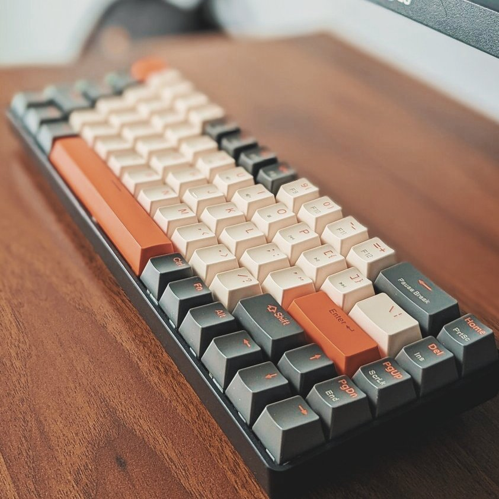
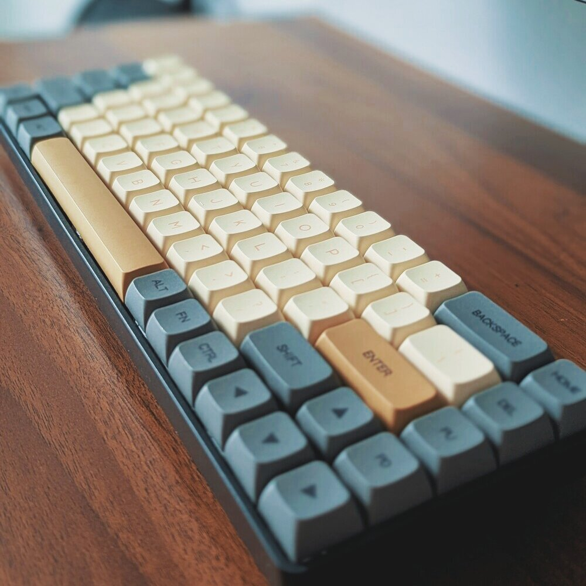
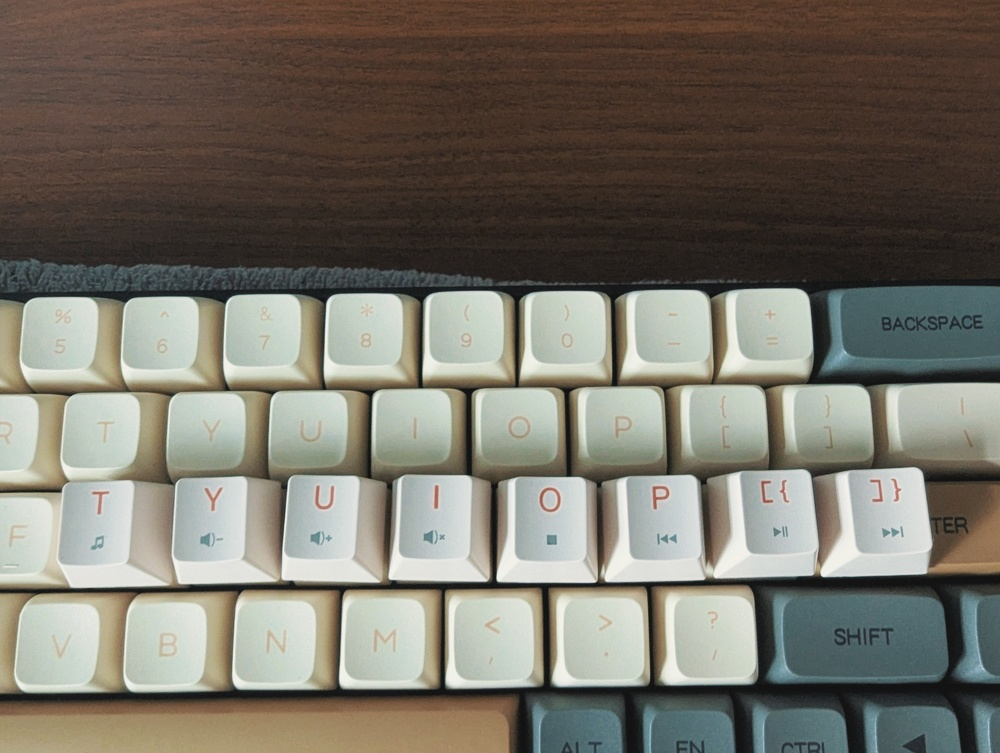
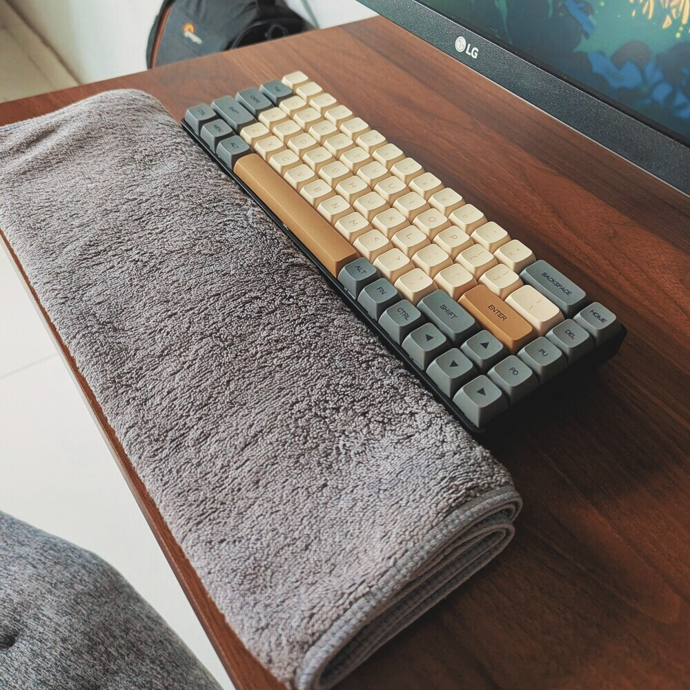
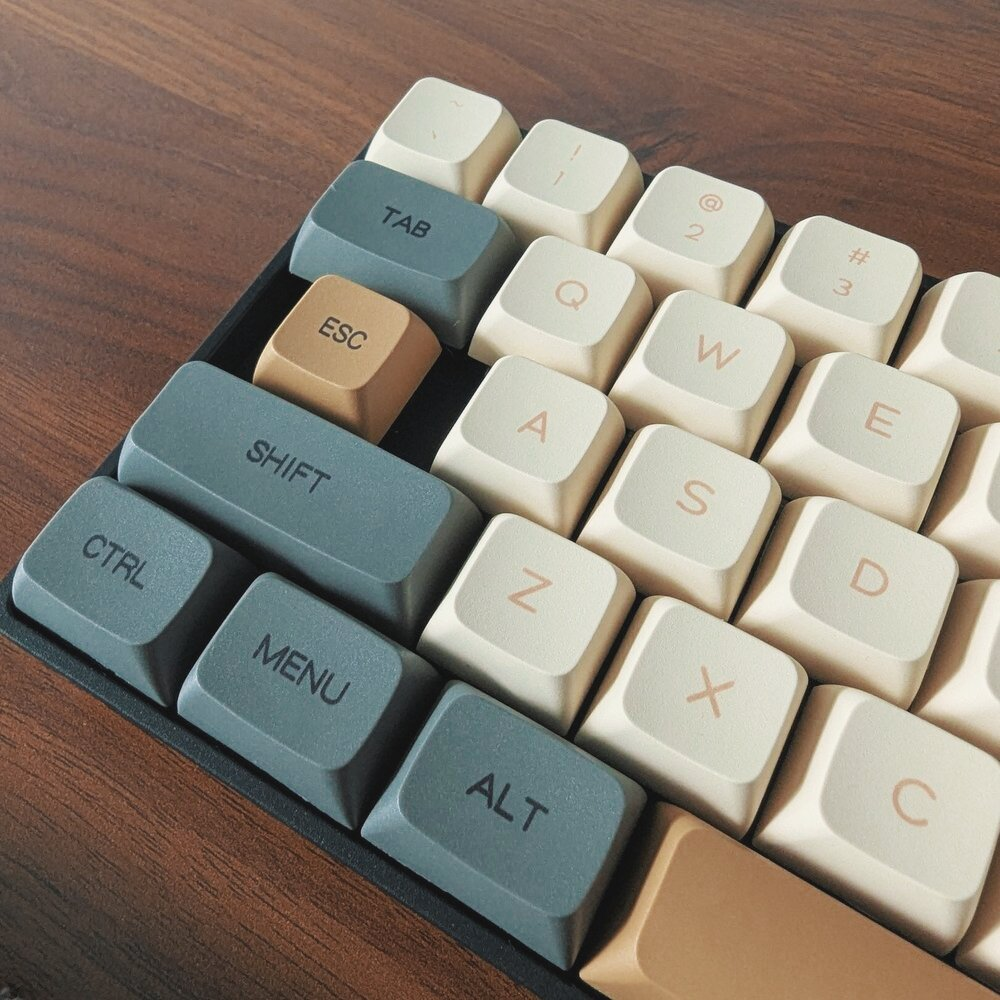

## Dùng phím giá rẻ?

Tôi từng dùng con phím Keychron K8 Pro, với tầm giá trên 2 triệu cho một cái bàn phím thì đối với tôi là có hơi đắt quá.
Dùng được một năm thì vô tình trong lúc vừa coi meme vừa uống nước, sặc một phát ướt cả màn hình và phím phủng.

Từ đó bắt đầu có hiện tượng mất kết nối bluetooth, một vài LED cũng tịt màu.
Xài được thêm gần một năm nữa thì ngủm luôn.
Không nhận tín hiệu, không thể Factory Reset bằng .
Đem đi sửa thì cửa hàng họ kêu không có mạch để thay.

Đây không phải một bài bốc phốt Keychron, trong quá trình sử dụng thật sự là rất chất lượng.
Em nó hỏng là do tôi bất cẩn mà thôi!

Sau khi cay cú trách bản thân làm quả sặc nước quá tốn tiền, tôi quyết định mua một con phím gần như là rẻ nhất thị trường, ***ZIYOULANG K68***.

Có ba lí do chính khiến tôi chọn mua một con phím giá rẻ:

* Thiết nghĩ thấy một khi đã hư thì đồ rẻ hay mắc gì cũng hẹo, thôi thì xài đồ rẻ, lỡ hư thì đỡ thiệt hại hơn.
* Sợ rằng thói bất cẩn của tôi sẽ tiễn thêm một em phím đắt tiền ra đi nữa.
* Cũng có ý độ mod nhưng không nỡ vọc vạch một con phím đắt tiền.
* Quan trọng nhất, ***KHÔNG CÓ TIỀN!***

Đây không phải một bài review, bạn có thể tìm "ZIYOULANG K68" trên YouTube để xem review.
Bài viết này chỉ là tiêu chí, trải nghiệm của tôi và những điều tôi đã làm để cải thiện em phím này thôi!

---

## Tiêu chí - Ưu điểm

Lưu ý rằng tôi chả biết gì về phím cơ cả, chỉ biết rằng cảm giác bấm và phản hồi sướng tay hơn bàn phím cao su.

Nên đừng dùng những tiêu chí chọn phím của tôi để áp dụng lên bạn nhé!
Nếu bạn đang muốn mua một con phím thì trên các diễn đàn có rất nhiều người đầy kinh nghiệm sẵn sàng chỉ dẫn.
Hầu hết những tiêu chí dưới đây tôi cũng tổng hợp lại từ mọi người mà ra.

Và cũng chính vì đáp ứng đủ các tiêu chí này nên tôi đã quyết định đón em nó về nhà!

### Nhỏ gọn

Như đã chia sẻ ở [bài viết này](/tap-yeu-nhung-dieu-binh-di) tôi là một tín đồ của lối sống tối giản.

Có khi cũng bất tiện nhưng tôi sẵn sàng hy sinh một ít thời gian để làm quen với con phím nhỏ gọn hơn là bị hạn chế không gian với những con phím "full size", có phần rối mắt nữa.



Kiểu dáng nhỏ nhắn ngoài lợi ích là ít tốn diện tích thì khoảng cách và cách bố trí các phím cũng khít nhau hơn.
Tôi hay dùng "vim motion" trong các ứng dụng, do đó bàn phím nhỏ gọn và các phím sát nhau là yêu cầu đầu tiên.

Việc tích hợp các phím ít khi dùng bằng phím  đối với tôi là rất hợp lý.
Kích thước bàn phím trở nên tối ưu hơn rất nhiều.
Tuy nhiên điều này cũng dẫn tới một nhược điểm tôi sẽ nói ở phần sau.

### Hotswap

Đối với tôi, một trong những ưu điểm lớn nhất của bàn phím cơ so với bàn phím thường là ***khả năng tuỳ biến***, cũng giống như Linux so với Windows vậy.
Nếu không thích âm thanh của switch hiện tại, tôi có thể dễ dàng thay cả bộ switch của mình để "thay giọng" cho con phím này.

Switch cũng là một bộ phận có thể hư hỏng của bàn phím, do đó việc dễ dàng tháo switch ra thay thế là rất quan trọng, so với những con phím hàn chết chân switch lên mạch.
Theo tôi thấy thì khả năng hotswap gần như là yêu cầu cơ bản, bắt buộc phải có của các anh em chơi phím cơ luôn rồi!

### Dễ tháo rời

Tương tự như ý ở trên, nhưng không chỉ dừng lại ở switch.
Tôi muốn vọc vạch con phím của mình, tối ưu hoá, giảm ồn, tăng trọng lượng của nó.
Thật ra đây là do thói thích vọc vạch của tôi chứ cũng không hẳn là ai cũng vậy.

Việc dễ dàng tháo rời sẽ hỗ trợ cho nhu cầu độ mod, sửa chữa trong tương lai.
Mặc dù với giá này có khi mua con mới còn tối ưu hơn là sửa, nhưng mà tôi thích tự mày mò cơ. Với lại tiền đâu mà cứ hư là mua mới hoài...

### Không có LED

Khá lạ đời nhưng _sự thiếu vắng LED_ lại là ưu điểm đối với tôi.
Không như hồi cuối cấp 3, LED giờ đây đối với tôi là rất thừa thãi.
Con phím K8 Pro cũ tôi cũng không khi nào để đèn LED (một phần là do bị thọt vài bóng).

Khi dùng máy tính, tôi muốn toàn tâm tập trung vào nội dung trên màn hình, văn bản đang chỉnh sửa, đoạn code đang mày mò, tin nhắn đang gõ,...

Việc có một **"nguồn sáng rực rỡ"** phía dưới màn hình chỉ khiến tôi thường xuyên mất tập trung mà thôi.

Dùng máy tính đã khá lâu, bố cục các phím cũng là thứ đã quá quen thuộc.
Việc gõ chữ (không nói các phím chức năng) nhiều khi không cần nhìn cũng chính xác được.

Do đó lí do phải có LED nền thì mới gõ trong đêm được không còn đúng nữa.
Mà này, ban đêm thì đi ngủ giùm tôi phát, thức làm chi rồi lại không thấy đường?!

### Pin rời

Cũng khá lạ đời... Tôi không thích dùng phím pin sạc.
Có vẻ như bệnh của con K8 Pro cũ của tôi cũng là do pin mà ra.

Khi dùng pin rời:

* Hết pin thì thay nhanh gọn lẹ, trừ khi không có sẵn.
* Không cần phải lo chai pin hay gì cả.
* Hiện tượng nóng lên do pin cũng không có.
* Điều quan trọng nhất, ***không phụ thuộc vào nhà sản xuất***.
Pin AAA hãng nào cũng dùng được tất.
* Pin sạc nếu lỡ có hư phải tháo tung bàn phím, lựa mua thỏi pin phù hợp, rất bất tiện.

---

## Khuyết điểm

Dưới đây là vài khuyết điểm tôi bắt gặp trong quá trình xài.
Đừng lo vì hầu hết các vấn đề này đều có thể phần nào khắc phục được!

### Keycap và phím chức năng

Tôi có mua thêm bộ keycap màu cổ điển một xíu để hợp với bàn gỗ nhà mình.



Do đặc điểm tận dụng phím , một số phím chức năng như tăng giảm âm lượng, điều khiển đa phương tiện, ,... đều sẽ không thể nhìn thấy.



Để khắc phục nhược điểm này tôi đã bấm bụng thay lại bộ keycap cũ để dùng một thời gian cho quen.

Nếu tương lai vẫn không thể nhớ được thì chắc tôi sẽ lưu một tấm hình layout đâu có khi nào quên thì lôi ra xem...

Đây là nhược điểm của mọi bàn phím khi thay keycap chứ không chỉ con phím này.

### Mặt phím cao

Độ cao từ mặt bàn lên đến mặt phím khá lớn, nếu không có kê tay thì thật sự rất khó chịu, vừa vướng víu vừa mỏi.

Do đó tôi đã xếp một cái khăn tắm thành một miếng kê tay tạm thời.
Hiện tại thấy cũng khá ổn, không biết về lâu về dài thế nào...



### Phím ngã

Trong môi trường Linux, tôi rất thường xuyên dùng đến ký tự `~`.
Tuy nhiên trên con phím này, muốn gõ phím ký tự `~` phải bấm cùng lúc tận 3 phím .
Do đó để thuận tiện hơn tôi đã dùng `keyd`, một trình gán phím của linux.

> **Tại sao lại là Keyd?**
>
> Có rất nhiều trình gán phím trên Linux, nhưng hầu hết chỉ có thể áp dụng sau khi đã khởi chạy Display Server (X11, Wayland).
Nghĩa là môi trường tty sẽ không có gì thay đổi.
>
> Keyd hoạt động ở tầng thấp nhất, do đó nó có thể gán phím ngay cả khi trong tty.

Rất may mắn là Void Linux có sẵn phần mềm này trong repository của họ. Trước tiên tôi cài keyd bằng lệnh sau:

```sh
$ sudo xbps-install -S keyd
```

Sau đó tạo một file cài đặt cho keyd:

```sh
$ sudo mkdir /etc/keyd
$ sudo touch /etc/keyd/default.conf
```

Nội dung của `default.conf` như sau:

```ini
*
capslock = esc
esc = grave
```

Sau đó tôi kích hoạt keyd tự động chạy bằng lệnh sau:

```sh
$ sudo ln -s /etc/sv/keyd /var/service
```

Để khởi động trực tiếp mà không cần reboot, tôi dùng lệnh:

```sh
$ sudo sv up keyd
```

Lưu ý đây chỉ là những câu lệnh đặc thù trên Void Linux, nếu bạn dùng bất cứ distro nào khác thì hãy tìm hiểu cách cài đặt keyd của distro đó.

Đọc file `default.conf` chắc bạn cũng đã hình dung được các tuỳ chọn gán phím của tôi:

> `esc = grave`: Đổi phím  thành , nghĩa là khi phối hợp với  sẽ ra  như bình thường.
>
> `capslock = esc`: Đổi phím  thành , đây là một thói quen của tôi, vì Vim rất thường xuyên dùng phím . Vị trí của phím  là quá thích hợp rồi.

Tôi không bao giờ dùng Capslock, do đó với kiểu gán phím này dù có mất đi phím  thì cũng không sao.

> Theo tôi nhớ là lệnh `setxkbmap` có thể giúp bạn bấm cùng lúc hai nút  trên bàn phím để bật tắt Capslock.
>
> Ở đây tôi sẽ không nói đến chủ đề này, nếu bạn cần thì hãy tham khảo trên mạng bằng từ khoá này `setxkbmap shift:both_capslock`

---

## Một vài thứ khác

Vì trước sau gì phím  bây giờ cũng hoạt động như một phím  nên tôi đã thay keycap cho nó luôn để khỏi nhầm lẫn.
Mặc dù nhìn có hơi kì...



Trong quá trình đọc review trên mạng cũng có một vài anh em than rằng con này xài tầm vài tháng là tự động không nhận tín hiệu.
Vì chỉ vừa mới dùng được vài hôm thôi nên tôi vẫn chưa thể kết luận điều này có đúng không.

---

## Kết luận

Trước mắt là vậy, tôi sẽ dùng thử một thời gian, nếu có gì hư hỏng sẽ có một bài viết nói tiếp về con phím này.
Cảm ơn anh em đã đọc đến đây và mong rằng những chia sẻ trên bổ ích với anh em!
