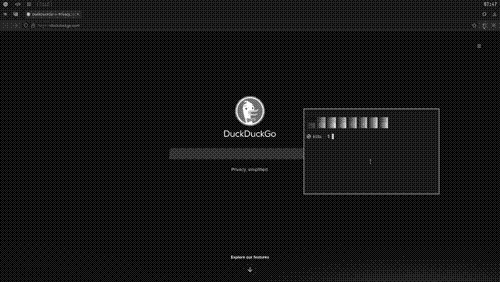

[#suckless]
== Suckless

https://suckless.org/community/[Suckless community] là một cộng đồng những người đam mê công nghệ và từ chối xu hướng trở nên "béo phì" _(bloat)_ của các phần mềm hiện tại (một phần mềm làm đủ thứ chức năng, phức tạp và khó bảo trì, nhiều lỗ hổng).

https://suckless.org/philosophy/[Suckless philosophy] có thể được xem như chủ nghĩa tối giản trong thế giới phần mềm. Sản phẩm của họ luôn có giới hạn về dòng code và tuân theo https://en.wikipedia.org/wiki/Unix_Philosophy[Unix Philosophy], đối với tôi triết lý này có thể được tóm gọn như sau:

> Phần mềm chỉ *duy nhất* làm đúng việc của mình, và làm việc đó *một cách tốt nhất*.

---

[#dwm]
== dwm - Dynamic window manager

*dwm* là https://en.wikipedia.org/wiki/Window_manager[trình quản lý cửa sổ] của Suckless. Tính đến nay tôi dùng dwm được tầm một năm rưỡi, cũng có bỏ túi được tí kinh nghiệm. Bài viết này sẽ ghi lại quá trình tôi setup dwm của mình, dưới đây là một danh sách những thứ tôi sẽ làm:

* link:/dwm/#dependencies[Cài đặt gói cần thiết]
* link:/dwm/#source-code[Tải mã nguồn]
* link:/dwm/#patches[Cài đặt patch]
 . link:/dwm/#pertag[Pertag]
 . link:/dwm/#sticky[Sticky]
 . link:/dwm/#save-floats[Save floats]
 . link:/dwm/#hide-vacant-tags[Hide vacant tags]
 . link:/dwm/#remove-border[Remove border]
 . link:/dwm/#always-center[Always center]
 . link:/dwm/#shift-tools[Shift tools]
 . link:/dwm/#monocle-symbol[Monocle symbol]
* link:/dwm/#no-title[Gỡ bỏ thanh tiêu đề]
* link:/dwm/#no-dmenu[Gỡ ràng buộc với dmenu]
* link:/dwm/#bar-height[Chiều cao thanh trạng thái]
* link:/dwm/#colors[Màu sắc]
* link:/dwm/#no-root[Không cần root]

---

[#dependencies]
== Cài đặt gói cần thiết

Trước hết ta cần một môi trường linux đủ các "gói cần thiết" _(dependencies)_ để dwm hoạt động. Lệnh cài đặt các gói này tùy vào distro và package manager bạn dùng:

[,bash]
----
# Debian/Ubuntu/PopOS
sudo apt install git curl build-essential libx11-dev libxft-dev libxinerama-dev

# Arch Linux
sudo pacman -Sy git curl base-devel libx11 libxft libxinerama

# Void Linux
sudo xbps-install -S git curl base-devel libX11-devel libXft-devel libXinerama-devel
----

Nếu máy của bạn không có nhiều màn hình (multi-monitor), bạn có thể comment hoặc xóa hai dòng sau trong `config.mk` và không cần cài đặt các gói `Xinerama' tương ứng với từng distro. Hai thư viện này giúp dwm hỗ trợ đa màn hình, nếu không cần, xóa đi cũng đỡ được tí mã nguồn đấy!

[,Makefile]
----
XINERAMALIBS  = -lXinerama
XINERAMAFLAGS = -DXINERAMA
----

---

[#source-code]
== Tải mã nguồn

Vào lúc tôi viết bài viết này thì bản cập nhật gần đây nhất của dwm là 6.5, công bố ngày 19/03/2024. Để tải mã nguồn dwm về máy, bạn có thể dùng lệnh sau:

[,bash]
----
git clone https://git.suckless.org/dwm
----

Nếu không có nhu cầu dùng git về sau, bạn có thể xóa các file và thư mục của git trong folder dwm vừa được clone về bằng lệnh:

[,bash]
----
rm -rf ./dwm/{README,LICENSE,.git}
----

---

[#patches]
== Cài đặt patch

Bản chất những phần mềm của cộng đồng Suckless lúc ra lò cực kỳ đơn giản vì thế khó lòng đáp ứng nhu cầu của người dùng. Điều này là chủ ý của họ, họ cung cấp một phần mềm mang tính nền móng, tối giản, cực kỳ ổn định _(stable)_ và làm tốt nhiệm vụ của mình. Phần còn lại như thêm bớt các tính năng, tinh chỉnh, tùy biến giao diện... là do toàn quyền người dùng quyết định. Những sửa đổi tùy biến màu sắc, phím tắt đơn giản đối với tôi nên được gọi là cài đặt.

Patch là những thay đổi về mặt chức năng, các hàm, phần cốt lõi và tinh vi hơn trong mã nguồn. Khái niệm patch (có thể hiểu là bản vá, chỉnh sửa) là một thứ xa lạ với người dùng máy tính phổ thông, nếu bạn thấy khó hiểu và có phần e ngại thì đừng lo! Hồi mới dùng các phần mềm của Suckless tôi cũng không hiểu gì cả... Vì tâm lý người dùng trước giờ dạng như mỳ ăn liền, tải về dùng ngay. Chuyển sang các phầm mềm triết lý Suckless không thể không bỡ ngỡ, vì giống như được trao một đặc quyền là trước giờ chưa từng được nắm giữ, tùy chỉnh 100% phần mềm của mình, từng dòng code một!

Ở đây tôi sẽ cài đặt các patches theo thứ tự độ phức tạp giảm dần. Nghĩa là tôi sẽ xem file diff của từng patch, xem độ dài ngắn, mức độ phức tạp (thay đổi file gốc nhiều hay ít) để rồi sẽ apply những patches phức tạp trước. Đây là một kinh nghiệm tôi học được sau nhiều lần làm việc với các phần mềm Suckless. Tin tôi đi, khi các patches phức tạp được apply từ đầu, việc apply các patch đơn giản về sau là dễ hơn nhiều!

Các patches sẽ được lưu dưới định dạng file diff. Nó đơn giản chỉ là file thể hiện những thay đổi của một văn bản, khi một người chỉnh sửa mã nguồn của phần mềm, họ sẽ dùng lệnh diff để so sánh mã nguồn cũ với mã nguồn mới và xuất ra file diff. Bạn chỉ cần chú ý tên của file được so sánh, dòng có dấu `+` và `-`. Tôi sẽ giải thích rõ hơn khi cài đặt các patches gặp mâu thuẫn.

---

[#pertag]
=== Pertag

Bạn có thể hiểu tag trong dwm gần giống như workspace hay màn hình ảo (virtual desktop). Patch này giúp những tùy chỉnh về số lượng master, layout... sẽ được lưu ở mỗi tag thay vì đồng bộ chúng như mặc định dwm làm. Nghĩa là sau khi cài patch này, ta có thể để tag 1 ở layout tile và tag 2 ở layout monocle.

.Thao tác
[%collapsible]
====

Đầu tiên chúng ta sẽ tải file diff của `pertag` về máy, ở đây tôi sẽ dùng lệnh curl. Link của các files diff tôi sẽ để ở ghi chú số nhỏ cạnh tên các patch. Để thư mục gọn gàng hơn tôi sẽ tạo một thư mục con chỉ để chứa các files diff.

[,bash]
----
# tạo thư mục patches để chứa các files diff
$ mkdir dwm/patches

# cd vào folder mã nguồn của dwm
$ cd dwm

# tải file diff của patch pertag vào thư mục patches
$ curl https://dwm.suckless.org/patches/pertag/dwm-6.1-pertag_without_bar.diff -o patches/pertag.diff
----

Để tiến hành apply patch tự động, ta dùng lệnh patch, lưu ý bạn phải đang ở trong thư mục gốc của dwm nhé:

[,bash]
----
$ patch -i ./patches/pertag.diff
patching file dwm.c
Hunk #3 succeeded at 273 (offset 1 line).
Hunk #4 succeeded at 644 (offset -6 lines).
Hunk #5 succeeded at 655 (offset -6 lines).
Hunk #6 succeeded at 1006 (offset -1 lines).
Hunk #7 succeeded at 1536 (offset -7 lines).
Hunk #8 succeeded at 1561 with fuzz 2 (offset -7 lines).
Hunk #9 succeeded at 1783 (offset 23 lines).
Hunk #10 succeeded at 2100 (offset 22 lines).
----

Như bạn thấy, lệnh tôi nhập là `patch -i ./patches/pertag.diff` và bên dưới trả kết quả mọi thứ đều "succeeded" nghĩa là okela hết!
====

---

[#sticky]
=== Sticky

Patch này cho phép ta gán phím tắt để chuyển cửa sổ bình thường thành cửa sổ "dính" _(sticky)_, điều này khiến cửa sổ đó sẽ theo ta cho dù ta ở tag nào đi nữa. Thích hợp dùng chung với chức năng "Picture-in-picture" của các trình duyệt web để việc xem video và đa nhiệm được tiện lợi hơn!

.Thao tác
[%collapsible]
====
[,bash]
----
$ curl https://dwm.suckless.org/patches/sticky/dwm-sticky-6.4.diff -o patches/sticky.diff
$ patch -i patches/sticky.diff
----
====

---

[#save-floats]
=== Save floats

Mặc định khi chuyển đổi nhanh (toggle) giữa floating mode và tiling mode, cửa sổ sẽ nằm ở vị trí tương tự khi nó đang tiling và các cửa sổ khác sẽ lấp đầy vị trí cũ của nó. Patch này sẽ lưu vị trí
khi đang float của cửa sổ và khôi phục lại vị trí đó khi bạn chuyển đổi chế độ của nó. Ví dụ một cửa sổ đang float ở chính giữa màn hình, khi tôi đưa nó vào tiling mode nó sẽ nằm ngay ngắn vào chung các cửa sổ khác, khi tôi chuyển nó thành floating mode lại, nó sẽ nằm ngay giữa màn hình như lúc đầu.

.Thao tác
[%collapsible]
====
[,bash]
----
$ curl https://dwm.suckless.org/patches/save_floats/dwm-savefloats-20181212-b69c870.diff -o patches/save-floats.diff
$ patch -i patches/save-floats.diff
----
====

---

[#hide-vacant-tags]
=== Hide vacant tags
Patch này đơn giản sẽ ẩn các tags trống (không chứa cửa sổ nào), làm gọn gàng thanh trạng thái!

.Thao tác
[%collapsible]
====
[,bash]
----
$ curl https://dwm.suckless.org/patches/hide_vacant_tags/dwm-hide_vacant_tags-6.4.diff -o patches/hide-vacant-tags.diff
$ patch -i patches/hide-vacant-tags.diff
----
====

---

[#remove-border]
=== Remove border

Đơn giản là ẩn khung cửa sổ (border) khi chỉ có một cửa sổ trên màn hình.

.Thao tác
[%collapsible]
====
[,bash]
----
$ curl https://dwm.suckless.org/patches/removeborder/dwm-removeborder-20220626-d3f93c7.diff -o patches/remove-border.diff
$ patch -i patches/remove-border.diff
----
====

---

[#always-center]
=== Always center

Cửa sổ floating *khi bật* sẽ luôn nằm ngay giữa màn hình thay vì góc trên cùng bên trái màn hình. Tuyệt vời nhất khi phối hợp với `save floats`.

.Thao tác
[%collapsible]
====
[,bash]
----
$ curl https://dwm.suckless.org/patches/alwayscenter/dwm-alwayscenter-20200625-f04cac6.diff -o patches/always-center.diff
$ patch -i patches/always-center.diff
Hunk #1 FAILED at 1057.
1 out of 1 hunk FAILED -- saving rejects to file dwm.c.rej
----

Patch này khi apply sẽ báo lỗi trong file `dwm.c` tại dòng này:

[,c]
----
	updatewindowtype(c);
	updatesizehints(c);
	updatewmhints(c);
	c->sfx = c->x;
	c->sfy = c->y;
	c->sfw = c->w;
	c->sfh = c->h;
----

Đây là đoạn code trong patch `save floats` ở trên. Để khắc phục mâu thuẫn này, gộp cả hai chức năng của hai patches, tôi chọn thay dòng mâu thuẫn như sau:

[,c]
----
	updatewindowtype(c);
	updatesizehints(c);
	updatewmhints(c);
	c->sfx = c->x = c->mon->wx + (c->mon->ww - WIDTH(c)) / 2;
	c->sfy = c->y = c->mon->wy + (c->mon->wh - HEIGHT(c)) / 2;
	c->sfw = c->w;
	c->sfh = c->h;
----

Như thế là ta có thể tận dụng được cả chức năng của `save floats` và `always center` rồi đấy!
====

---

[#shift-tools]
=== Shift tools

Ở patch này sẽ có tí khác biệt, vì tôi sẽ không dùng tất cả các hàm (functions) mà nó mang lại, do đó sẽ có một số tinh chỉnh gỡ bỏ bớt các chức năng không dùng tới. Nhưng đầu tiên ta vẫn sẽ làm các bước như trước, chỉ là bạn sẽ tải file diff tôi viết tại repo GitLab chứ không phải trên trang chủ của Suckless.

.Thao tác
[%collapsible]
====
[,bash]
----
$ curl https://gitlab.com/khiemtu27/dwm/-/raw/master/patches/shift-tools.diff -o patches/shift-tools.diff
$ patch -i patches/shift-tools.diff
----
====

---

[#monocle-symbol]
=== Monocle symbol

Mặc định biểu tượng layout (bên phải dãy số các tags trên thanh trạng thái) sẽ hiển thị số cửa sổ đang mở trong tag hiện tại. Tôi không thích chức năng này và chỉ muốn nó hiện biểu tượng của monocle layout thôi.

.Thao tác
[%collapsible]
====
[,bash]
----
$ curl https://dwm.suckless.org/patches/monoclesymbol/dwm-monoclesymbol-6.2.diff -o patches/monocle-symbol.diff
$ patch -i patches/monocle-symbol.diff
----
====

---

[#no-title]
== Gỡ bỏ thanh tiêu đề

Mặc định phần tên cửa sổ trên thanh trạng thái của dwm sẽ dùng màu accent để làm background, đây có thể là điểm nhấn thẩm mỹ, nhưng tôi lại không thích điều này. Do đó tôi viết một patch để gỡ bỏ hoàn toàn hiển thị tên cửa sổ trên thanh trạng thái.

.Thao tác
[%collapsible]
====
[,bash]
----
$ curl https://gitlab.com/khiemtu27/dwm/-/raw/master/patches/notitle.diff -o patches/notitle.diff
$ patch -i patches/notitle.diff
----
====

---

[#no-dmenu]
== Gỡ ràng buộc với dmenu
Mặc định trong file cài đặt của dwm (config.def.h) có các biến và cài đặt như `dmenufont`, `dmenumon`, `dmenucmd`. Tôi thích các script gọi dmenu của mình nằm riêng biệt với mã nguồn của dwm nên thường xóa các dòng này trong `config.h`. Một điều bạn có thể thấy ngay khi xóa các dòng này là dwm sẽ lỗi khi build. Vì trong dwm.c cũng có một chỗ phụ thuộc vào những biến này. Thế nên tôi đã viết một patch để gỡ bỏ hoàn toàn dmenu khỏi mã nguồn dwm. Lưu ý là tôi sẽ giữ lại chức năng gọi dmenu bằng tố hợp phím kbd:[Mod+P].

.Thao tác
[%collapsible]
====
[,bash]
----
$ curl https://gitlab.com/khiemtu27/dwm/-/raw/master/patches/nodmenu.diff -o patches/nodmenu.diff
$ patch -i patches/nodmenu.diff
----
====

---

[#bar-height]
== Chiều cao thanh trạng thái

Trước đây tôi dùng patch link:https://dwm.suckless.org/patches/statuspadding[statuspadding] để thay đổi chiều cao cũng như căn ngang hai bên lề của thanh trạng thái. Nhưng suy đi nghĩ lại, việc vào `config.h` để tùy chỉnh cũng không khác gì vào `dwm.c`. Cài thêm một patch chỉ làm tăng khả năng mâu thuẫn với các patches khác.

.Thao tác
[%collapsible]
====
Do đó tôi quyết định nếu có muốn tùy chỉnh chiều cao thanh trạng thái, tôi sẽ vào `dwm.c` và thay đổi dòng này:

[,c]
----
bh = drw->fonts->h + 2;
----

Dòng này quyết định biến `bh` viết tắt của barheight, nói chung nó sẽ lấy chiều cao của font chữ, cộng thêm 2 pixels. Từ đây, để điều chỉnh chiều cao thanh trạng thái, hãy tự tin thay đổi phần `+ 2` thành bất cứ số gì bạn muốn. Đối với tôi, `+ 6` là ổn nhất. Do đó, biến `bh` của tôi sẽ trông như sau.

[,c]
----
bh = drw->fonts->h + 6;
----
====

---

[#colors]
== Màu sắc

Để thuận tiện cho việc thay đổi giao diện của dwm, cụ thể là màu sắc thanh trạng thái và viền cửa sổ. Tôi thường không thay đổi từng màu trong `config.h` mà sẽ tạo riêng lẻ từng file màu sắc riêng và chỉ cần thay đổi một dòng trong `config.h` là đã có thể thay đổi tất cả các màu của `dwm`.

.Thao tác
[%collapsible]
====

[,bash]
----
$ curl https://gitlab.com/khiemtu27/dwm/-/raw/master/patches/colors.diff -o patches/colors.diff
$ patch -i patches/colors.diff
----

Tôi đã đính kèm sẵn các bảng màu sau:

. link:https://github.com/catppuccin/catppuccin[*Catppuccin (Mocha)*]
. *Dark*
. link:https://draculatheme.com[*Dracula*]
. link:https://github.com/morhetz/gruvbox[*Gruvbox (Hard)*]
. link:https://github.com/rebelot/kanagawa.nvim[*Kanagawa (Wave)*]
. link:https://www.nordtheme.com[*Nord (Dark)*]
. *One Dark*
. link:https://rosepinetheme.com/[*Rosé Pine*]
. link:https://github.com/ghifarit53/tokyonight-vim[*Tokyo Night (Storm)*]

Màu viền và `active tag` tôi sẽ dùng màu xanh lá. Nếu bạn không thích thì hãy vào các file `colors-???.c` và thay đổi màu có tên `col_af` tôi cố tình viết tắt của `colors_active-foreground`.

Mẫu các bảng màu bạn có thể xem link:/st/#showcase[tại đây.]
====

---

[#no-root]
== Không cần root
Mỗi lần tinh chỉnh file `config.h` và rebuild dwm, vì mặc định dwm cài đặt vào các thư mục như `/usr/local/bin/` nên đòi hỏi phải có quyền root (hầu hết chúng ta dùng `sudo` để làm điều này). Đối với tôi đây là một điều khá phiền phức, do đó tôi sẽ chuyển vị trí cài đặt mặc định từ `/usr/local` thành `$HOME/.local`.

[CAUTION]
====
Để đảm bảo bước này thành công, bạn phải chắc chắn rằng trong `$PATH` của mình có địa chỉ `$HOME/.local/bin`. Nếu không sau khi cài đặt dwm sẽ không xuất hiện cho chúng ta khởi chạy. Để kiểm tra, hãy thử nhập lệnh này:

[,bash]
----
echo $PATH
----

Nếu trong chuỗi kết quả không có đoạn `/home/<tên người dùng>/.local/bin` thì hãy thêm dòng sau vào `~/.bash_profile`.

[,bash]
----
export PATH=$HOME/.local/bin:$PATH
----

Một lưu ý nhỏ nữa là thay đổi này sẽ khiến chỉ có người dùng bạn dùng để build dwm mới có thể dùng dwm, những người dùng khác trên hệ thống nếu muốn dùng sẽ phải tự build một bản cho riêng mình.
====

.Thao tác
[%collapsible]
====
Trong file `config.mk` có một dòng như sau:

[,makefile]
----
PREFIX = /usr/local
----

Biến `PREFIX` này sẽ được nhắc đến trong `Makefile` -- có thể xem là file kịch bản những việc sẽ làm khi chúng ta nhập `make clean install`.

Để thay đổi vị trí cài dwm vào `$HOME/.local/bin`, bạn có thể dùng lệnh sau:

[,bash]
----
$ sed -i 's/^PREFIX =.*$/PREFIX = \/home\/$(shell whoami)\/.local/' config.mk
----

Lệnh `sed` này sẽ tìm trong file `config.mk` dòng bắt đầu bằng `PREFIX =` và thay cả dòng đó thành `PREFIX = /home/$(shell whoami)/.local`. Khi bạn chạy lệnh `make install`. Biến `PREFIX` sẽ được khởi tạo, bên trong biến này có cụm `$(shell whoami)` sẽ dùng kết quả của lệnh `whoami` lấp vào chỗ đó.

[NOTE]
=====
`whoami` là lệnh để tra cứu tên người dùng hiện tại, bạn có thể nhập vào terminal của mình lệnh này để thử.
=====

Nghĩa là biến `PREFIX` lúc này sẽ là `/home/<tên người dùng>/.local`. Thế là xong, sau này mỗi lần cài đặt dwm không cần phải dùng lệnh `sudo` nữa.
====

---

[#showcase]
== Thành quả!

video::showcase.mp4[showcase,width=600,align=center,opts="autoplay,loop,nocontrols,muted"]

Thế là sau khi cài đặt các patches, chúng ta đã có một dwm "đầy đủ" chức năng rồi. Phần còn lại chỉ là tùy chỉnh file `config.h`, thêm các phím tắt, thay đổi màu sắc, font... sau đó xóa file config.h và chạy lệnh `make clean install`. Ở một bài viết khác tôi sẽ nói về `sx`, một script khởi chạy môi trường Xorg cũng như khởi chạy dwm.

Bản hoàn thiện sau khi cài đặt tất cả các patches tôi sẽ để https://gitlab.com/khiemtu27/dwm[ở đây]. Nếu không muốn mất công cài đặt patch theo hướng dẫn này bạn chỉ cần clone repo này về và `make clean install` là dùng dwm được rồi nhé!
