:sectnums:

Với những người dùng Linux, terminal emulator là thứ không thể thiếu, tôi cũng vậy. Phím tắt tiện nhất trên bàn phím của tôi là kbd:[Mod+x] cũng là để mở một cái terminal. Trong bài viết này tôi sẽ ghi lại cách tôi build cho mình một terminal nhỏ gọn, tối giản và chỉ thực hiện những gì tôi cần.

Simple Terminal gọi tắt là _st_ là một terminal đến từ link:/suckless[Suckless]. Vì đây là bài viết số hai trong series về các phần mềm của Suckless nên tôi sẽ không nói về họ nữa.

Để xây dựng một st cho mình, tôi sẽ làm những việc như sau:

* link:/st/#dependencies[Cài đặt gói cần thiết]
* link:/st/#source-code[Tải mã nguồn]
* link:/st/#patch[Cài đặt patch]
. link:/st/#scroll-back[Scroll back]
. link:/st/#boxdraw[Boxdraw]
. link:/st/#ligatures[Ligatures]
. link:/st/#expexted-anysize[Anysize]
. link:/st/#bold-is-not-bright[Bold is not bright]
. link:/st/#delkey[Del key]
* link:/st/#colors[Màu sắc]

---

[#dependencies]
== Cài đặt gói cần thiết

Để build st, trước hết ta phải có các thư viện và các phần mềm cần thiết trong máy. Dùng lệnh sau để cài nhé:

[,bash]
----
# Debian/Ubuntu/PopOS
sudo apt install git curl build-essential pkg-config libxft-dev libharfbuzz-dev

# Arch Linux
sudo pacman -Sy git curl base-devel libxft

# Void Linux
sudo xbps-install -S git curl base-devel libXft-devel harfbuzz-devel
----

---

[#source-code]
== Tải mã nguồn

Bây giờ chúng ta sẽ clone mã nguồn của st về máy từ git server của Suckless, sau đó tạo thư mục để chứa các patches.

[,bash]
----
# clone mã nguồn
$ git clone https://git.suckless.org/st

# tạo thư mục patches
$ mkdir ./st/patches

# cd vào folder `st`
$ cd ./st
----

---

[#patch]
== Cài đặt patches
Tôi sẽ giải thích về khái niệm patch (bản vá) trong link:/suckless[bài viết về Suckless], bạn có thể tham khảo cụ thể vấn đề này link:/suckless/#patch[tại đây].

[#scroll-back]
=== Scroll back
Mặc định st không có chức năng cuộn trang lên xuống lịch sử terminal, vâng, họ thật sự tối giản tới mức như vậy đấy. Thật tình mà nói, không phải muốn bênh Suckless nhưng mà đây cũng là một chức năng ít khi dùng tới. Thẳng thắng mà nói thì được bao nhiêu lần ta cuộn lên xuống trong terminal đâu. Nhưng do đã quá quen thao tác các trang web có thanh cuộn trang nên giờ phải mang chức năng này vào terminal.

Đây là một patches phức tạp, thật ra là tổng hợp của 3 patches:

- link:https://st.suckless.org/patches/scrollback/st-scrollback-20210507-4536f46.diff[scrollback]: thêm chức năng cuộn trang với phím tắt kbd:[Shift+PageUp]

- link:https://st.suckless.org/patches/scrollback/st-scrollback-reflow-20230607-211964d.diff[scrollback-reflow]: chức năng gói dòng (wrap) khi cửa sổ thay đổi kích thước, dưới đây sẽ là ví dụ trước và sau khi cài `scrollback-reflow`.

.Hành vi mặc định, nội dung bên trong terminal sẽ mất hết khi cửa sổ thu nhỏ lại, chỉ còn lại dòng prompt.
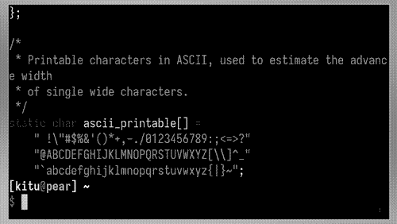

.Sau khi có patch reflow, nội dung bên trong terminal sẽ được giữ lại ngay cả khi cửa sổ bị thu lại nhỏ xíu.
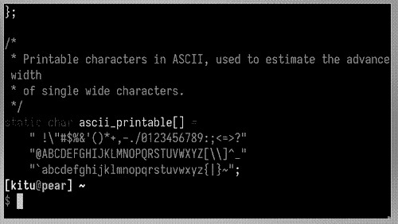

- link:https://st.suckless.org/patches/scrollback/st-scrollback-mouse-20220127-2c5edf2.diff[scrollback-mouse]: gán chức năng cuộc trang lên con lăn của chuột

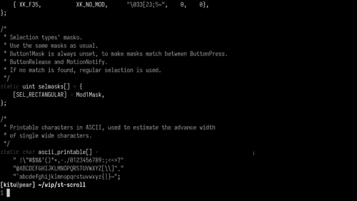

.Thao tác
[%collapsible]
====
Vì cài đặt các patch này dễ gặp mâu thuẫn nên tôi sẽ soạn lại file diff bao gồm cả 3 patches cho tiện lợi, do đó chúng ta sẽ tải file diff từ repo của tôi.

[,bash]
----
$ curl https://gitlab.com/khiemtu27/st/-/raw/master/patches/scrollback.diff -o patches/scrollback.diff
$ patch -i patches/scrollback.diff
----
====

---

[#boxdraw]
=== Boxdraw

Khi sử dụng terminal, sẽ có lúc ta gặp phải những hộp được vẽ bằng những ký tự đặt biệt. Chẳng hạn như hình dưới đây.

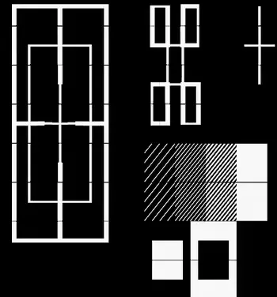

Để ý sẽ thấy những đường thẳng không liền mạch mà có những điểm giao nhau khá khó chịu, patch `boxdraw` sẽ khắc phục điều này.

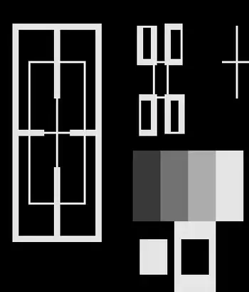

.Thao tác
[%collapsible]
====
[,bash]
----
$ curl https://gitlab.com/khiemtu27/st/-/raw/master/patches/boxdraw.diff -o patches/boxdraw.diff
$ patch -i patches/boxdraw.diff
----
====

---

[#ligatures]
=== Ligatures

Ký tự nối _(ligatures)_ là những ký tự đặt biệt được tạo nên từ 2 ký tự chẳng hạn như æ, œ, ≦, ≠... Những ký tự nối này đòi hỏi các khối (cell) trong terminal phải biến hóa khác đi một chút để kết hợp với nhau thành một ký tự mới.

Tất cả nội dung hiển thị trong terminal về bản chất đều là những khối (cell), trừ một vài trường hợp mưu mẹo hiển thị hình ảnh trong terminal bằng cách phối hợp với X11 như link:https://github.com/ueber-devel/ueberzug[ueberzug]. Những khối này có kích thước y hệt nhau, đó cũng là lí do vì sao terminal không thể hiển thị nhiều kích thước font cùng lúc.

[NOTE]
Hãy thử mở file config.def.h lên bạn sẽ thấy hai biến có tên `cwscale` và `chscale` đó là hai biến dùng để cân chỉnh `cell width` và `cell height` (chiều rộng khối và chiều cao khối).

Dưới đây là hai hình ảnh so sánh trước và sau khi cài patch hỗ trợ ký tự nối cho st.

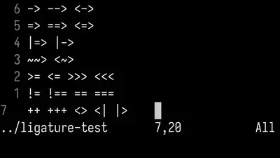

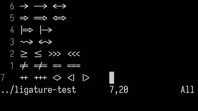

[CAUTION]
====
. Sau khi cài patch này tất cả các ký tự bạn gõ như kbd:[!]kbd:[=], kbd:[>]kbd:[>], kbd:[-]kbd:[>] đều sẽ được hiển thị khác đi như hình phía trên.

. Khả năng hiển thị ký tự nối còn tùy vào font bạn đang dùng.

. Nếu như đã cài patch này mà các ký tự nối vẫn chưa hiển thị đúng, như ví dụ trên, thì hãy thử cài một trong những fonts tại link:https://www.nerdfonts.com/font-downloads[Nerd Fonts].

. Font tôi dùng trong hình là *IosevkaTerm*.
====

.Thao tác
[%collapsible]
====
Ở đây tôi sẽ dùng bản có hỗ trợ `scrollback` và cả `boxdraw` thay vì những bản được công bố ở link:https://st.suckless.org/patches/ligatures[website của Suckless]. Bản patch này do tôi tự mày mò tinh chỉnh nên sẽ được đặt ở repo GitLab của tôi.

[,bash]
----
$ curl https://st.suckless.org/patches/ligatures/0.9/st-ligatures-boxdraw-20240105-0.9.diff -o patches/ligatures.diff
$ patch -i patches/ligatures.diff
----
====

---

[#expexted-anysize]
=== Anysize

Mặc định st sẽ vẽ _(render)_ kích thước cửa sổ của mình theo đơn vị cột và dòng (column and row). Điều này khiến việc thay đổi kích thước (resize) cửa sổ cũng chỉ là thay đổi số dòng và cột, không thể thay đổi chính xác từng pixel như các phần mềm khác.

Khi dùng trình quản lý cửa sổ chia ô (tiling window manager) sẽ xuất hiện những khoảng trống như hình dưới đây, kể cả bề ngang lẫn bề dọc đều không thể chạm mép màn hình, vì khoảng cách đến mép màn hình là hẹp hơn một dòng/cột.

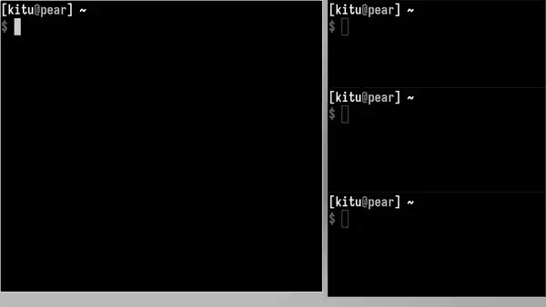

Có thể bạn sẽ không cảm thấy đây là một vấn đề quan trọng vì chỉ là phần nhìn thôi. Riêng tôi thi sẽ dùng patch này để khiến st vẽ cửa sổ của mình bằng đơn vị pixel (đơn vị biểu diễn nhỏ nhất trên mọi màn hình). Lúc này st sẽ lấp phần còn trống (mép bên phải và phía dưới) của mình bằng những pixels, nên sẽ đảm bảo lấp trống được phần còn lại của màn hình.

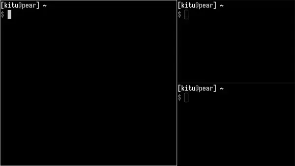

.Thao tác
[%collapsible]
====
[,bash]
----
$ curl https://st.suckless.org/patches/anysize/st-expected-anysize-0.9.diff -o patches/expected-anysize.diff
$ patch -i patches/expected-anysize.diff
----
====

---

[#delkey]
==== Del key

Mặc định st *không gán* phím kbd:[Del] với chức năng xóa ký tự sau con trỏ như ở mọi nơi khác, tôi cũng không hiểu tại sao. Nhưng không sao, patch `delkey` sẽ khắc phục điều này.

.Thao tác
[%collapsible]
====
[,bash]
----
$ curl https://st.suckless.org/patches/delkey/st-delkey-20201112-4ef0cbd.diff -o patches/delkey.diff
$ patch -i patches/delkey.diff
----
====

---

[#bold-is-not-bright]
==== Chỉ in đậm

Màu sắc hiển thị trong terminal thường gồm 16 màu như dưới đây:

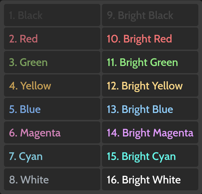

Ngoài ra để đa dạng hơn trong hiển thị, font chữ trong terminal cũng hỗ trợ các kiểu cách như `_nghiêng_` và `*đậm*`.

Tuy nhiên vì lí do nào đó, mặc định st sẽ đánh đồng kiểu dáng `*bold*` cũng sẽ có nhóm màu `bright`. Patch này sẽ tách riêng chúng ra bằng cách xóa đi dòng mã này:

[,c]
----
if ((base.mode & ATTR_BOLD_FAINT) == ATTR_BOLD && BETWEEN(base.fg, 0, 7))
	fg = &dc.col[base.fg + 8];
----

Hai dòng này thuộc về một mệnh đề `if`.

. Nếu ký tự này: 
- Có `ATTR_BOLD` đúng, "bold attribute" có thể tạm dịch là _thuộc tính đậm_.
- Có màu thuộc từ 0 đến 7, theo bảng màu trên là từ 1 đến 8, đen đến trắng.
. Thì `fg = &dc.col[base.fg + 8]` nghĩa là `foreground` sẽ được cộng thêm 8. Biến mọi màu trong bảng trên thành phiên bản `bright` tương ứng.

.Thao tác
[%collapsible]
====
[,bash]
----
$ curl https://st.suckless.org/patches/bold-is-not-bright/st-bold-is-not-bright-20190127-3be4cf1.diff -o patches/bold-is-not-bright.diff
$ patch -i patches/bold-is-not-bright.diff
----
====

---

[#colors]
=== Màu sắc

Một trong những yếu tố quyết định đẹp xấu của một terminal emulator là bảng 16 màu của chúng. Thật ra là có tới 18 màu, 16 màu như trên với màu nền _(background)_ và màu chữ _(foreground)_, đôi khi còn cả màu con trỏ _(cursor)_.

Lâu lâu tôi thường thay đổi màu sắc terminal của mình cho đỡ chán mắt, nhưng để phải vào config.h để thay đổi từng màu một thì rất phiền... Do đó tôi sẽ bóc tách bảng màu ra những files riêng, và chỉ cần thay đổi một dòng trong config.h là có thể thay đổi màu sắc.

.Thao tác
[%collapsible]
====

[,bash]
----
$ curl https://gitlab.com/khiemtu27/st/-/raw/master/patches/colors.diff -o patches/colors.diff
$ patch -i patches/colors.diff
----

Tôi đã đính kèm sẵn các bảng màu sau:

. link:https://github.com/catppuccin/catppuccin[*Catppuccin (Mocha)*]
. *Dark*
. link:https://draculatheme.com[*Dracula*]
. link:https://github.com/morhetz/gruvbox[*Gruvbox (Hard)*]
. link:https://github.com/rebelot/kanagawa.nvim[*Kanagawa (Wave)*]
. link:https://www.nordtheme.com[*Nord (Dark)*]
. *One Dark*
. link:https://rosepinetheme.com/[*Rosé Pine*]
. link:https://github.com/ghifarit53/tokyonight-vim[*Tokyo Night (Storm)*]

Để tạo cho mình một bảng màu, bạn truy cập link:https://terminal.sexy[website này]:

. Chỉnh sửa màu tùy ý thích
. Vào tab Export, chọn Simple Terminal
. Copy đoạn mã nguồn đó vào một file có đuôi `.c` trong thư mục gốc của st
. Xem các file `colors-???.c` mẫu có sẵn để xóa các dòng thừa ở dưới
. Chỉnh sửa dòng `#include "colors-???.c"` trong file config.h.
. Sau đó rebuild st bằng lệnh sau `sudo make clean install`
====

---

[#showcase]
== Thành quả

Nếu bạn chưa biết cách cài đặt st lên máy hãy tham khảo qua link:/suckless/#install[bài viết này] nhé!

Mã nguồn của bản st này tôi sẽ công khai ở link:https://gitlab.com/khiemtu27/st[repo GitLab của tôi].  Dưới đây sẽ là ảnh chụp màn hình của tất cả các bảng màu đi kèm để bạn có thể tham khảo.

.Catppuccin (mocha)
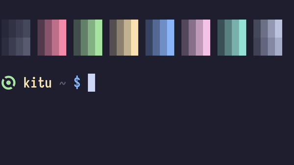

.Dark
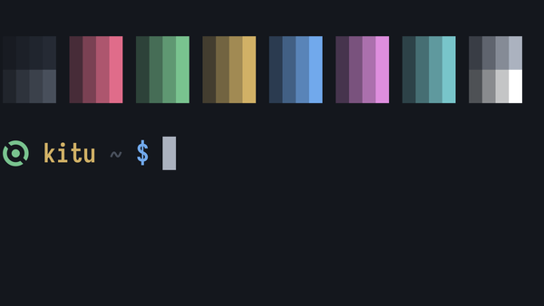

.Dracula
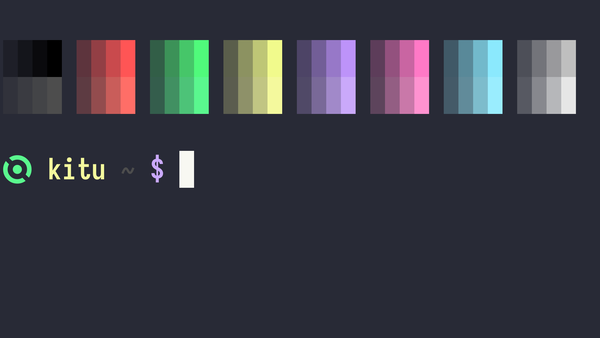

.Gruvbox (hard)
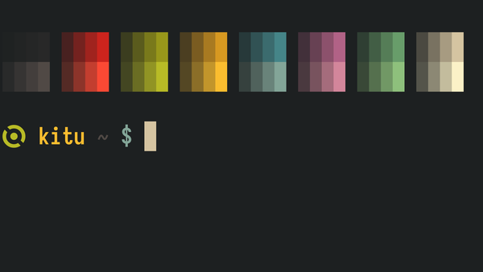

.Kanagawa (wave)
image::kanagawa.png[Kanagawa,width=600,align=center]

.Nord (dark)
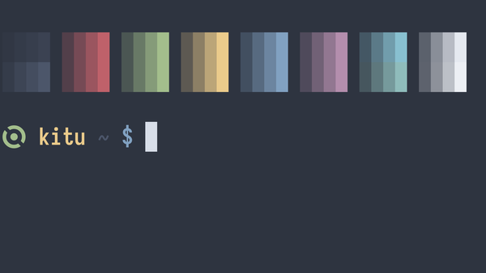

.One Dark
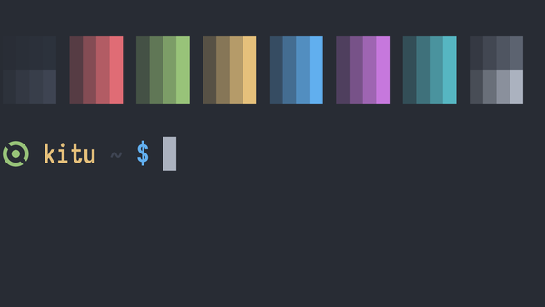

.Rose Pine
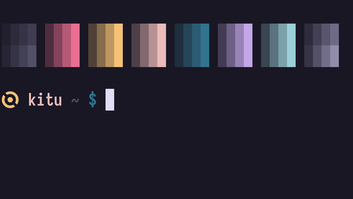

.Tokyo Night
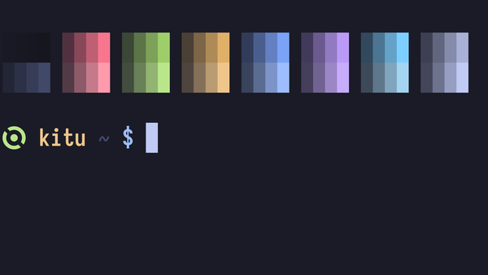
