:toc:
:sectnums:
:figure-caption!:

Sau link:/vim-1[phần một] của chuỗi bài viết về Vim, hôm nay tôi sẽ nói về các phím tắt tôi dùng, một vài phím tắt tôi học lỏm được trên mạng, các dotfiles của những người đi trước.
Vì đây là bài viết thứ hai trong chuỗi nên tôi sẽ không giới thiệu dài dòng nữa, bắt đầu nhé!

== Cơ bản

[NOTE]
====
Trong bài viết này sẽ có hai dạng biểu diễn phím tắt bạn nên để ý kỹ:

1. Giữ cùng lúc nhiều phím: kbd:[Ctrl+c], kbd:[Alt+P]

2. Bấm lần lượt, bấm phím này xong buông ra bấm phím tiếp theo: kbd:[d]kbd:[d], kbd:[Leader]kbd:[p]kbd:[v]

Đồng thời, phím kbd:[c] và kbd:[C] là khác nhau nhé!
====

=== Tải lại
Sau mỗi lần thay đổi file `vimrc`, không cần phải dùng lệnh `:source $MYVIMRC` nữa, chỉ cần bấm kbd:[Leader]kbd:[r].

[,vim]
----
noremap <Leader>r :so $MYVIMRC<CR>
----

---

=== Vimrc
Khi ở bất kỳ đâu trong Vim, chỉ cần bấm kbd:[Leader]kbd:[,] để mở `vimrc` trong một tab mới.

[,vim]
----
noremap <Leader>, :tabnew $MYVIMRC<CR>
----

---

=== Đừng thoát!
Mặc định Vim sẽ thoát ngay lập tức khi bấm kbd:[Q], dòng này chỉ để tắt chức năng này để không phải thoát nhầm mà không lưu lại gì.

[,vim]
----
noremap Q <nop>
----

---

== Chỉnh sửa văn bản

=== Thay thế toàn tệp

Trong Normal Mode, bấm kbd:[S] để gõ nhanh cú pháp _tìm và thay thế_ trong toàn tệp.

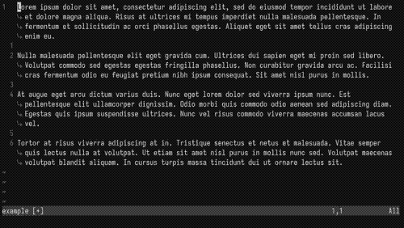

[,vim]
----
nnoremap S :%s//g<Left><Left>
----

---

=== Dịch chuyển

Khi trong Normal Mode, chọn cả dòng bằng cách bấm kbd:[V], sau đó dùng phím kbd:[J] và kbd:[K] để dời một hoặc nhiều dòng đang chọn lên xuống.

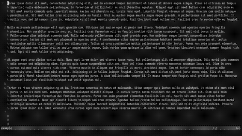

[,vim]
----
vnoremap <silent> J :m'>+<CR>gv=gv
vnoremap <silent> K :m-2<CR>gv=gv
----

---

=== Thêm dòng trống

Trong Normal Mode:

- kbd:[Leader]kbd:[o] thêm một dòng trống phía *dưới* dòng hiện tại.

- kbd:[Leader]kbd:[O] thêm một dòng trống phía *trên* dòng hiện tại.

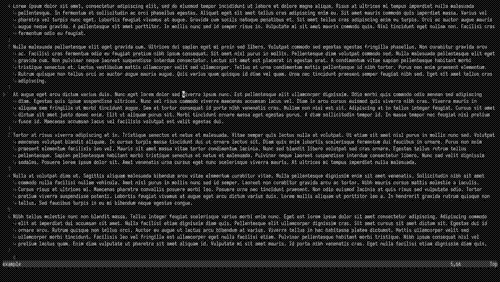

[,vim]
----
noremap <Leader>o m`o<Esc>``
noremap <Leader>O :call append(line('.')-1, '')<CR>
----

---

=== Dùng clipboard hệ thống

Phần này hơi phức tạp, bạn có thể bỏ qua phần giải thích, chỉ cần biết là kbd:[Leader]kbd:[y] sẽ copy vào clipboard hệ thống, kbd:[Leader]kbd:[p] sẽ paste từ clipboard hệ thống.

.Giải thích
[%collapsible]
====
Mặc định, khi dùng kbd:[y]kbd:[y], kbd:[d]kbd:[d]..., Vim sẽ không copy vào clipboard của hệ thống. Nghĩa là khi bạn sao chép một đoạn văn bản trong Vim bằng kbd:[y]kbd:[y], vào Firefox, kbd:[Ctrl+v] sẽ không dán đoạn bạn đã sao chép. Điều này là bởi mặc định Vim sẽ dùng registers của riêng nó, không dùng chung với clipboard của X server.

.Ví dụ một vài _Vim Registers_
[NOTE]
=====
`/` nội dung bạn vừa tìm kiếm

`"` nội dung bạn vừa kbd:[x], kbd:[y]...

`+` clipboard của hệ thống

Tìm hiểu tất cả link:https://www.baeldung.com/linux/vim-registers[tại đây].
=====

Registers có thể được xem như những cái hộp, nơi Vim sẽ chứa nội dung bạn vừa sao chép hoặc cắt để đặt vào nơi khác. Để gọi tên một register, ta dùng phím kbd:["]kbd:[register]. Như trong phần ví dụ trên, clipboard của hệ thống Vim sẽ lưu dưới register `+`.

[NOTE]
=====
Vì thế, để tương tác với clipboard của hệ thống ta phải dùng các tổ hợp phím như sau:

Sao chép cả dòng: kbd:["]kbd:[+]kbd:[y]kbd:[y]

Cắt từ con trỏ đến cuối dòng: kbd:["]kbd:[+]kbd:[D]

Dán: kbd:["]kbd:[+]kbd:[p]
=====

Bạn có thể coi đây như một trở ngại rườm rà, nhưng điều này cho phép ta thao tác với nội dung vừa được sao chép, làm đủ trò với chúng. Nói chung là một tí bất tiện thôi nhưng mở ra bao nhiêu khả năng mới mà các trình chỉnh sửa văn bản khác không thể.
====

[CAUTION]
====
Lưu ý rằng bạn phải cài bản Vim được build với tùy chọn `+clipboard` thì mới dùng được tính năng này nhé. Để kiểm tra Vim có hỗ trợ tương tác với clipboard hệ thống không hãy gõ dòng lệnh này vào Vim:

[,vim]
----
:echo has('clipboard')
----

Nếu kết quả trả lại là `0` thì Vim của bạn hiện không hỗ trợ thao tác này. Hãy thử gỡ Vim từ terminal và cài lại bản có hỗ trợ bằng lệnh sau:

[,bash]
----
# Debian
sudo apt purge vim
sudo apt install vim-gtk

# Arch Linux
sudo pacman -Rns vim
sudo pacman -Sy gvim

# Void Linux
sudo xbps-remove -R vim
sudo xbps-install -S gvim
----
====

[,vim]
----
noremap <Leader>y "+y
noremap <Leader>Y "+yy
noremap <Leader>p "+p
----

---

=== Xóa thật sự

Mặc định, các thao tác `yank` và `cut` trong Vim sẽ đưa phần văn bản được chọn vào register `"`. Điều này dẫn đến việc nếu bạn kbd:[d]kbd:[d] hai lần, dòng đầu tiên bạn cắt sẽ bị dòng sau ghi đè, và để xóa dòng hai mà không mất dòng một trong register `"`, bạn phải xóa nó vào một register _khoảng không_. Register này được gọi tên với tổ hợp kbd:["]kbd:[_].

Vì thế khi lỡ `yank` hoặc `cut` một dòng, muốn xóa dòng khác mà không mất dòng ban đầu tôi sẽ dùng các phím tắt kbd:[Leader]kbd:[d]kbd:[d] để xóa cả dòng,kbd:[Leader]kbd:[d]kbd:[$] để xóa từ con trỏ đến cuối dòng,kbd:[Leader]kbd:[d]kbd:[w] để xóa một từ.

[,vim]
----
noremap <Leader>dd "_dd
noremap <Leader>d$ "_d$
noremap <Leader>dw "_dw
----

---

== Di chuyển

=== Mode toggle
Một phím tắt duy nhất để thay đổi qua lại giữa Insert Mode và Normal Mode. kbd:[Ctrl+c] là phím tắt tôi hay dùng nhất khi thao tác với các phần mềm trong terminal. Thay vì dùng kbd:[i] và kbd:[Esc] để thay đổi qua lại, giờ ta chỉ cần một phím tắt rất tiện cho tay trái.

[,vim]
----
nnoremap <C-c> i
inoremap <C-c> <Esc>
----

---

=== Từng dòng một

Mặc định của Vim khi dùng kbd:[j] và kbd:[k] để di chuyển lên xuống xong Normal Mode sẽ di chuyển theo *đoạn* trong văn bản, không phải *dòng hiển thị* trong terminal. Ví dụ có một đoạn văn bản như sau, khi ta bấm phím kbd:[j], mặc định con trỏ sẽ nhảy xuống dòng số 2.

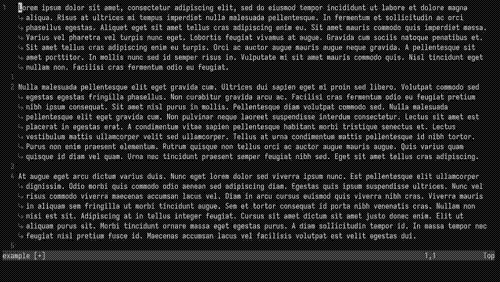

Điều này là hoàn toàn hợp lý vì Vim sẽ dời con trỏ xuống *một dòng trong file*, vì Vim đang gói _(wrap)_ dòng của chúng ta nên hiển thị trong terminal có vẻ đã xuống dòng nhưng thực tế trong văn bản không hề xuống dòng.

Việc di chuyển như vậy có phần khó khăn khi muốn chỉnh sửa đoạn giữa hoặc cuối của một dòng dài. May mắn thay, phím tắt kbd:[g]kbd:[j] sẽ đưa con trỏ xuống *một dòng thay vì một đoạn*. Và hầu hết lúc nào tôi cũng di chuyển như vậy nên tôi sẽ gán kbd:[j] và kbd:[k] thành kbd:[g]kbd:[j] và kbd:[g]kbd:[k] trong cả Normal Mode và Visual Mode.

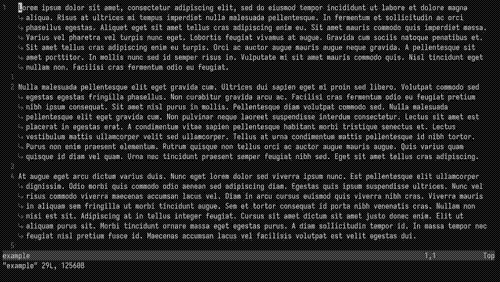

Ngoài ra thao tác di chuyển theo đoạn như trên cũng có ích trong vài trường hợp, nên việc thay thế kbd:[j], kbd:[k]thành kbd:[g]kbd:[j],kbd:[g]kbd:[k] làm mất đi chức năng di chuyển đoạn mặc định của kbd:[j] và kbd:[k]. Do đó tôi sẽ thay thế cả hai chiều, nghĩa là kbd:[g]kbd:[j], kbd:[g]kbd:[k] cũng sẽ thành kbd:[j], kbd:[k] tương ứng.

[,vim]
----
nnoremap k gk
nnoremap gk k
nnoremap j gj
nnoremap gj j
vnoremap k gk
vnoremap gk k
vnoremap j gj
vnoremap gj j
----

---

=== Insert Mode

Phím tắt kbd:[Ctrl+o] trong Insert Mode sẽ cho phép ta thực thi một lệnh (hoặc phím tắt) của Normal Mode mà không cần rời Insert Mode (thật ra là có, chỉ là Vim sẽ tự thoát Insert Mode, thực hiện lệnh và trở về nên người dùng vẫn thấy mình trong Insert Mode). Ví dụ trong Insert Mode, ta ấn kbd:[Ctrl+o] sau đó bấm kbd:[j], Vim sẽ xuống một dòng như khi ta bấm kbd:[j] trong Normal Mode thay vì nhập ký tự `j`.

Nhiều lúc trong Insert Mode tôi vẫn muốn di chuyển con trỏ mà không cần dùng phím mũi tên, do đó tôi sẽ gán kbd:[Ctrl+hjkl] tương ứng cho lên xuống trái phải. Có một lưu ý là tôi sẽ không di chuyển từng ký tự như mặc định phím kbd:[h] và kbd:[l] làm, thay vào đó tôi sẽ di chuyển từng từ một _(word by word)_ bằng phím kbd:[b] và kbd:[w].

[,vim]
----
inoremap <C-h> <C-o>b
inoremap <C-j> <C-o>gj
inoremap <C-k> <C-o>gk
inoremap <C-l> <C-o>w
----

---

=== Cửa sổ

Khi đang chỉnh sửa nhiều văn bản trong các cửa sổ (thường gọi là _buffers_ hoặc _windows_), bấm kbd:[Ctrl] và tương ứng các phím kbd:[h]kbd:[j]kbd:[k]kbd:[l] để focus vào từng cửa sổ trên màn hình.

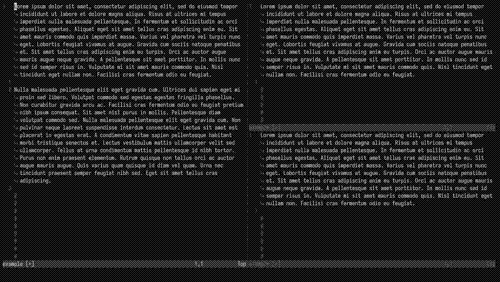

[,vim]
----
nnoremap <C-h> <C-w>h
nnoremap <C-j> <C-w>j
nnoremap <C-k> <C-w>k
nnoremap <C-l> <C-w>l
----

---

=== Luôn ở giữa

Khi tìm kiếm bằng kbd:[/], dùng kbd:[n] và kbd:[N] để di chuyển đến kết quả tìm kiếm tiếp theo, *dòng chứa kết quả* sẽ luôn ở chính giữa màn hình.

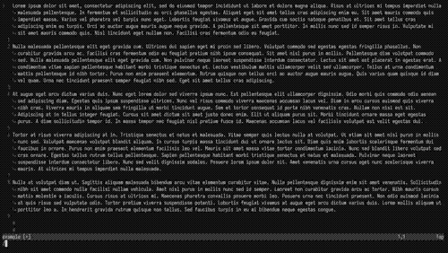

[,vim]
----
nnoremap n nzzzv
nnoremap N Nzzzv
----

---

Giữ con trỏ luôn ở giữa màn hình khi di chuyển nửa màn hình bằng tổ hợp phím kbd:[Ctrl+u] và kbd:[Ctrl+d].

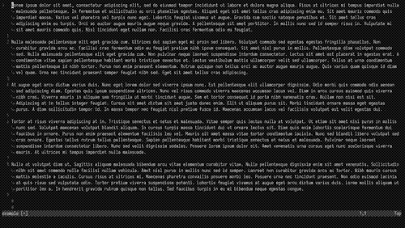

[,vim]
----
nnoremap <C-u> <C-u>zz
nnoremap <C-d> <C-d>zz
----

---

=== Chẻ ngang dọc

Khi đang có hai cửa sổ trên màn hình, bấm kbd:[Leader]kbd:[w]kbd:[v] để sang chế độ bổ dọc _(vertical split)_ và kbd:[Leader]kbd:[w]kbd:[h] sẽ chuyển từ bổ dọc thành bổ ngang _(horizontal split)_.

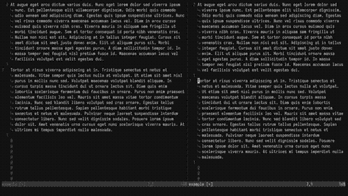

[,vim]
----
noremap <Leader>wv :wincmd H<CR>
noremap <Leader>wh :wincmd K<CR>
----

---

== Tabs

Ngoài chế độ cửa sổ, Vim còn có chế độ tab. Ví dụ đang chỉnh sửa file `a` muốn mở tab mới để chỉnh sửa file `b` bạn có thể dùng lệnh `:tabnew b`

=== Tab kế bên

Khi có nhiều tabs đang mở, phím tắt dưới đây sẽ cho phép bạn di chuyển qua lại giữa các tab theo thứ tự từ *trái sang phải* bằng phím kbd:[Leader]kbd:[Tab].

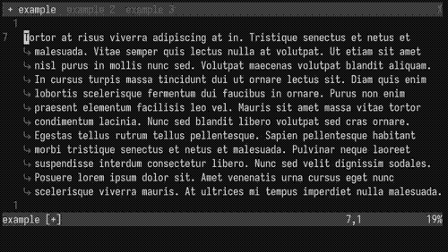

[,vim]
----
noremap <Leader><Tab> gt
----

---

=== Nhảy đến tab

Vì muốn kbd:[Leader] có vai trò tương tự phím kbd:[Mod] của link:/dwm[dwm] nên tôi gán kbd:[Leader]kbd:[1-9] thành di chuyển đến tab theo số thứ tự. Chức năng này mặc định Vim không có (hoặc tôi không biết là Vim có) nên tôi phải dùng một hàm `loop` để gán phím.

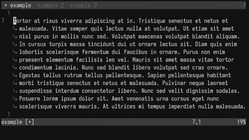

[,vim]
----
for i in range(1, 9)
    execute "nnoremap <Leader>" . i . " :" . i . "tabnext<CR>"
endfor
----

=== Tab cuối

Vì đã quen di chuyển các tabs bằng duy nhất tay trái nên việc bấm kbd:[Leader]kbd:[9] là hơi bất tiện, hoặc là có hơn 9 tabs đang bật, nên tôi sẽ gán kbd:[Leader]kbd:[`] thành di chuyển đến tab cuối cùng (tận cùng phải).

[,vim]
----
noremap <Leader>` :tablast<CR>
----

== Kết lại

Như thường lệ, file `vimrc` của tôi sẽ được công khai tại link:https://gitlab.com/khiemtu27/dotfiles/-/tree/master/vim[GitLab].

link:/vim-3[Phần tiếp theo] tôi sẽ nói về cách quản lý các plugins.
